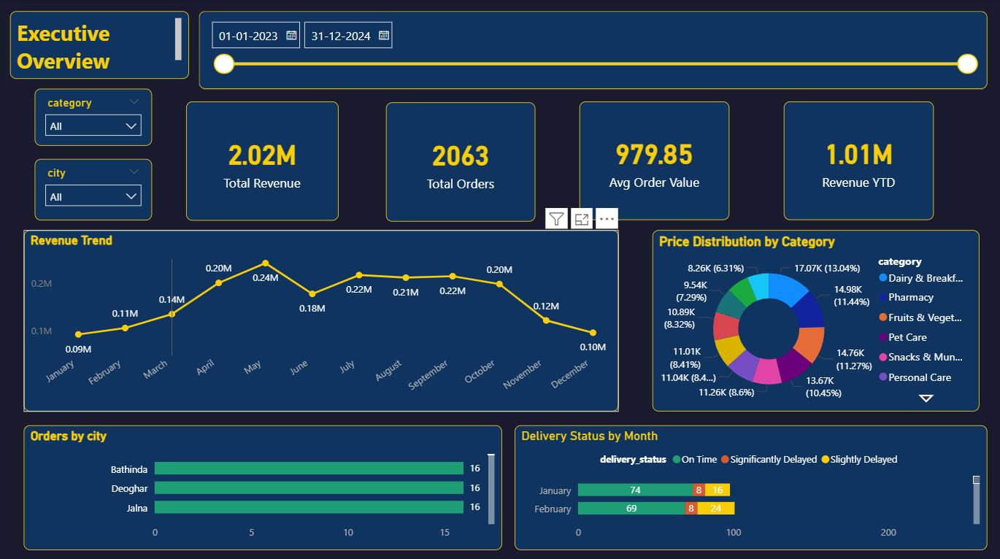
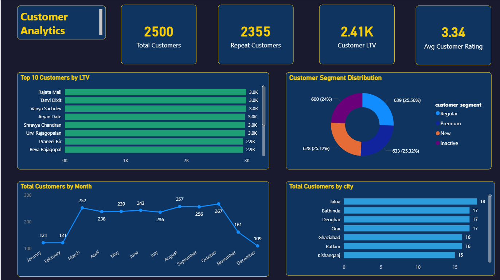
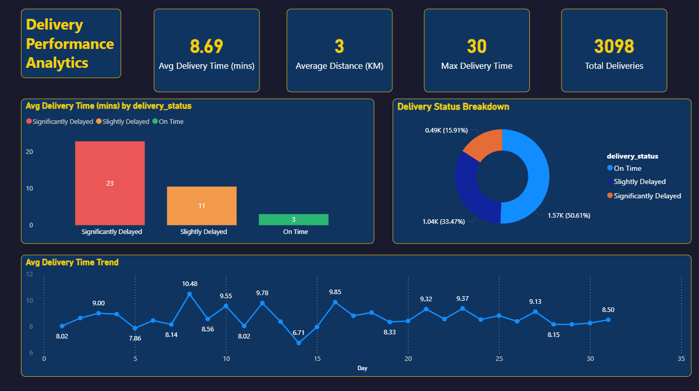
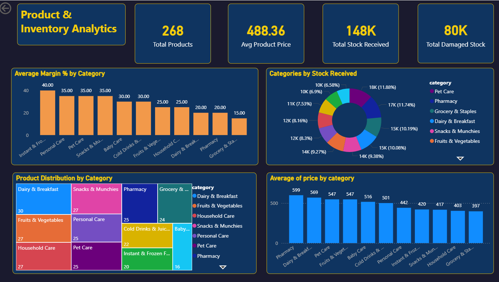
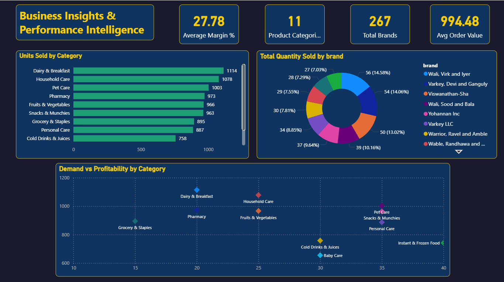
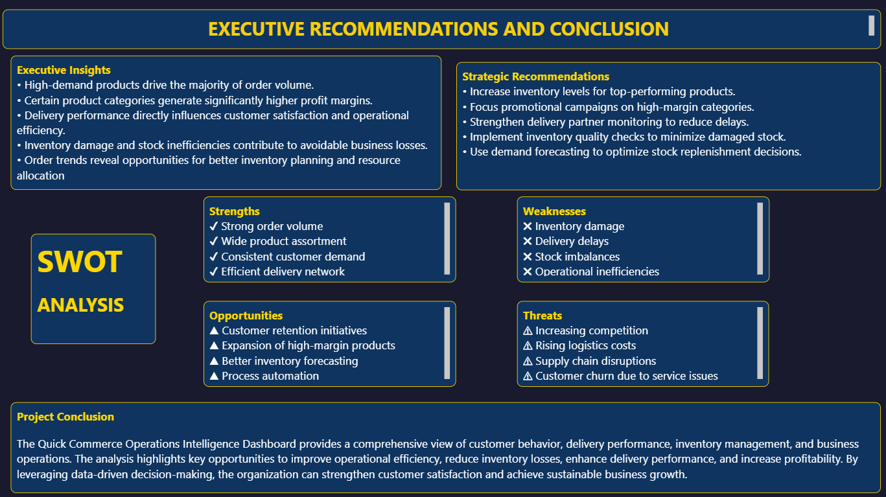

# 📊 Quick Commerce Operations Intelligence Dashboard

## 📌 Project Overview

This Power BI project analyzes quick commerce operations by tracking revenue, orders, customer behavior, delivery performance, and inventory metrics.

The dashboard helps identify operational bottlenecks, customer trends, delivery efficiency, and inventory performance to support data-driven decision making.

---

## 🎯 Business Objective

The objective of this project is to provide management with actionable insights into:

- Revenue Performance
- Customer Analytics
- Delivery Efficiency
- Product & Inventory Management
- Business Performance Monitoring

---

## 🛠 Tools & Technologies

- Power BI
- Power Query
- DAX
- Data Modeling
- Excel / CSV Data Sources

---

## 📈 Key Performance Indicators

- Total Revenue
- Total Orders
- Average Order Value (AOV)
- Revenue YTD
- Delivery Performance
- SLA Breach Analysis
- Product Distribution
- Inventory Performance

---

## 📷 Dashboard Pages

### Executive Overview

### Customer Analytics

### Delivery Performance Analytics

### Product & Inventory Analytics

### Business Insights & Performance Intelligence

### Executive Recommendations & Conclusion

---

## 🔍 Key Insights

- Revenue trends reveal seasonal demand fluctuations.
- Customer analytics highlights purchasing behavior and geographic distribution.
- Delivery performance metrics identify delayed deliveries and SLA breaches.
- Product and inventory analysis supports stock optimization.
- Business intelligence insights assist strategic decision-making.

---

## 💡 Recommendations

- Improve delivery partner allocation.
- Monitor SLA breaches proactively.
- Optimize inventory levels for high-demand products.
- Focus marketing efforts on high-performing categories.
- Use data-driven planning for operational efficiency.

---

## 👨‍💻 Author

**Sachin K Saji**

Business Analyst Intern

Skills:
Power BI | SQL | Excel | Python | Data Analysis
